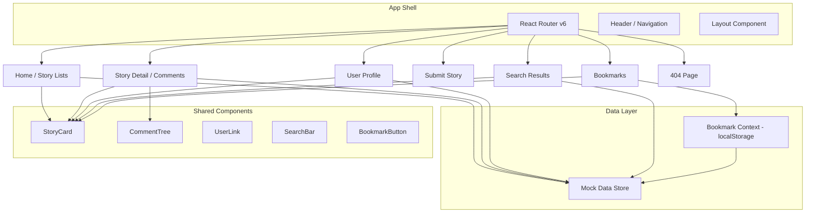

# Architecture Document — HN Redesign

<!-- Produced by: Tony (Architect) -->

## Overview

A modern, read-only Hacker News frontend built as a single-page application with React 18 and React Router v6. The app has 6 pages with client-side routing, a relational mock data layer (stories ↔ users ↔ comments), and localStorage-based bookmarks. No backend — all data is static/mock. Styled with CSS Modules for scoped, maintainable styles without runtime overhead.

## Tech Stack

| Layer | Choice | Rationale | Alternatives Considered |
|-------|--------|-----------|------------------------|
| Frontend Framework | React 18 | Brief mandates React. Stable, well-understood, component model fits | — (mandated) |
| Routing | React Router v6 | Brief mandates it. Supports nested routes, URL params, query strings | — (mandated) |
| Styling | CSS Modules | Zero runtime cost, scoped by default, no config needed with Vite. Simple. | Tailwind (config overhead, utility clutter), styled-components (runtime cost), vanilla CSS (naming conflicts) |
| Build Tool | Vite 5 | Fast HMR, zero-config React support via `@vitejs/plugin-react`, modern defaults | CRA (deprecated/slow), webpack (complex config), Parcel (less control) |
| State Management | React Context + useReducer | Sufficient for bookmarks + search state. No need for Redux/Zustand at this scale | Redux (overkill), Zustand (extra dep for simple state) |
| Data Layer | Static JS modules (mock data) | Brief says mock only. JS objects allow relational lookups. Easy to swap for API later | JSON files (no functions/computed fields), faker (unnecessary complexity) |
| Icons | Lucide React | Lightweight, tree-shakable, modern icon set | Heroicons (similar quality), FontAwesome (heavy) |
| Transitions | View Transitions API / CSS | Native browser support, no library needed for simple route transitions | Framer Motion (heavy for just transitions) |

## Server Environment

```
Node.js: v22.22.0
npm: 10.9.4
npx: 10.9.4
OS: Linux (Azure VM)
```

All tools verified and available. Vite + React installed via `npm create vite@latest` — no exotic dependencies.

## System Architecture



## Folder Structure

```
hn-redesign/
├── docs/                          # Project documents (brief, arch, design, QA)
├── public/
│   └── favicon.svg
├── src/
│   ├── main.jsx                   # Entry point, renders App
│   ├── App.jsx                    # Router setup, layout wrapper
│   ├── components/
│   │   ├── Header/
│   │   │   ├── Header.jsx
│   │   │   └── Header.module.css
│   │   ├── StoryCard/
│   │   │   ├── StoryCard.jsx
│   │   │   └── StoryCard.module.css
│   │   ├── CommentTree/
│   │   │   ├── CommentTree.jsx
│   │   │   └── CommentTree.module.css
│   │   ├── Comment/
│   │   │   ├── Comment.jsx
│   │   │   └── Comment.module.css
│   │   ├── UserLink/
│   │   │   └── UserLink.jsx
│   │   ├── SearchBar/
│   │   │   ├── SearchBar.jsx
│   │   │   └── SearchBar.module.css
│   │   ├── BookmarkButton/
│   │   │   ├── BookmarkButton.jsx
│   │   │   └── BookmarkButton.module.css
│   │   ├── StoryForm/
│   │   │   ├── StoryForm.jsx
│   │   │   └── StoryForm.module.css
│   │   ├── FilterBar/
│   │   │   ├── FilterBar.jsx
│   │   │   └── FilterBar.module.css
│   │   ├── Toast/
│   │   │   ├── Toast.jsx
│   │   │   └── Toast.module.css
│   │   ├── EmptyState/
│   │   │   ├── EmptyState.jsx
│   │   │   └── EmptyState.module.css
│   │   ├── Breadcrumb/
│   │   │   └── Breadcrumb.jsx
│   │   └── Badge/
│   │       └── Badge.jsx
│   ├── pages/
│   │   ├── HomePage/
│   │   │   ├── HomePage.jsx
│   │   │   └── HomePage.module.css
│   │   ├── StoryDetailPage/
│   │   │   ├── StoryDetailPage.jsx
│   │   │   └── StoryDetailPage.module.css
│   │   ├── UserProfilePage/
│   │   │   ├── UserProfilePage.jsx
│   │   │   └── UserProfilePage.module.css
│   │   ├── SubmitPage/
│   │   │   ├── SubmitPage.jsx
│   │   │   └── SubmitPage.module.css
│   │   ├── SearchPage/
│   │   │   ├── SearchPage.jsx
│   │   │   └── SearchPage.module.css
│   │   ├── BookmarksPage/
│   │   │   ├── BookmarksPage.jsx
│   │   │   └── BookmarksPage.module.css
│   │   └── NotFoundPage/
│   │       ├── NotFoundPage.jsx
│   │       └── NotFoundPage.module.css
│   ├── context/
│   │   └── BookmarkContext.jsx     # Bookmark state + localStorage persistence
│   ├── data/
│   │   ├── stories.js              # 50+ mock stories with all fields
│   │   ├── comments.js             # 200+ mock comments, nested by storyId
│   │   ├── users.js                # 20+ mock users with karma, about, created
│   │   └── index.js                # Relational lookup helpers (getStoriesByUser, getCommentsByUser, etc.)
│   ├── hooks/
│   │   ├── useBookmarks.js         # Hook wrapping BookmarkContext
│   │   └── useSearch.js            # Client-side search/filter logic
│   ├── utils/
│   │   ├── timeAgo.js              # Relative time formatting
│   │   ├── urlDomain.js            # Extract domain from URL
│   │   └── searchFilter.js         # Search + filter algorithm
│   └── styles/
│       ├── global.css              # CSS reset, variables, typography
│       └── variables.css           # Design tokens (colors, spacing, fonts)
├── index.html
├── vite.config.js
├── package.json
└── README.md
```

## Data Model

### Story

```js
{
  id: number,              // unique story ID
  type: 'story' | 'ask' | 'show',
  title: string,
  url: string | null,      // null for Ask HN
  text: string | null,     // body text for Ask HN / Show HN
  author: string,          // username (FK → users)
  points: number,
  commentCount: number,    // denormalized count
  createdAt: string,       // ISO timestamp
}
```

### Comment

```js
{
  id: number,
  storyId: number,         // FK → stories
  parentId: number | null, // null = top-level, else FK → comments
  author: string,          // FK → users
  text: string,            // comment body (HTML allowed)
  createdAt: string,
  children: [],            // computed at runtime from parentId
}
```

### User

```js
{
  username: string,        // PK
  karma: number,
  createdAt: string,       // ISO timestamp
  about: string | null,    // bio/about text
}
```

### Relational Lookup Functions (data/index.js)

```js
getStoryById(id) → Story
getStoriesByType(type) → Story[]
getStoriesByUser(username) → Story[]
getCommentsByStory(storyId) → Comment[]  // returns nested tree
getCommentsByUser(username) → Comment[]  // flat list
getUserByUsername(username) → User
searchStories(query, filters) → Story[]
searchComments(query, filters) → Comment[]
```

## Routing

| Route | Page | Params/Query |
|-------|------|-------------|
| `/` | HomePage | Redirects to `/top` |
| `/top` | HomePage | type=top |
| `/new` | HomePage | type=new |
| `/best` | HomePage | type=best |
| `/ask` | HomePage | type=ask |
| `/show` | HomePage | type=show |
| `/story/:id` | StoryDetailPage | id (number) |
| `/user/:username` | UserProfilePage | username (string) |
| `/submit` | SubmitPage | — |
| `/search` | SearchPage | ?q=query&type=story\|comment&sort=date\|points |
| `/bookmarks` | BookmarksPage | — |
| `*` | NotFoundPage | — |

## Component Map

| Component | Purpose | Props |
|-----------|---------|-------|
| Header | Global nav: logo, story type tabs, search bar, bookmarks icon, submit link | — |
| StoryCard | Renders a single story with title, domain, metadata, bookmark button | story, showBookmark? |
| CommentTree | Recursively renders nested comments | comments[], storyAuthor |
| Comment | Single comment with author link, time, collapse toggle, OP badge | comment, storyAuthor, depth |
| UserLink | Clickable username that links to /user/:username | username |
| SearchBar | Search input in header, navigates to /search?q= on submit | — |
| BookmarkButton | Toggle bookmark on/off for a story | storyId |
| StoryForm | Submit story form with validation and live preview | — |
| FilterBar | Search filter controls (type, date, sort) | filters, onChange |
| Toast | Success/error notification popup | message, type, onClose |
| EmptyState | Illustrated empty state (no bookmarks, no results) | title, description, icon |
| Breadcrumb | Navigation breadcrumb (e.g., Top Stories > Story Title) | items[] |
| Badge | Small label (OP badge, story type badge) | text, variant |

## Key Decisions

### Decision 1: Vite over CRA

- **Context:** Need a React build tool. CRA is deprecated.
- **Decision:** Vite 5 with `@vitejs/plugin-react`
- **Rationale:** Fast dev server, instant HMR, zero config, modern ESM-first approach. Industry standard for new React projects.
- **Consequences:** Need `vite.config.js` (minimal). No ejecting needed.

### Decision 2: CSS Modules over Tailwind

- **Context:** Styling approach for a design-heavy project where Natasha defines the visual system.
- **Decision:** CSS Modules
- **Rationale:** Natasha can define design tokens as CSS custom properties in `variables.css`, then use them in scoped module files. No utility class clutter — cleaner JSX, easier to express custom designs. Zero runtime cost.
- **Consequences:** More CSS files, but well-organized with co-located module files.

### Decision 3: Flat mock data with computed relationships

- **Context:** Need relational data (stories ↔ users ↔ comments) without a database.
- **Decision:** Flat arrays in JS modules + lookup functions in `data/index.js`
- **Rationale:** Simple, fast, easy to author 50+ stories by hand. Lookup functions abstract the "query" layer so swapping to real API later only changes `data/index.js`.
- **Consequences:** Must ensure referential integrity manually (all comment.author values must match a user.username).

### Decision 4: Context API for bookmarks (not Redux/Zustand)

- **Context:** Only persistent client state is bookmarks (array of story IDs).
- **Decision:** React Context + useReducer + localStorage sync
- **Rationale:** Bookmarks are a simple set of IDs. Context is built-in, no extra dependency. useReducer handles add/remove/check cleanly.
- **Consequences:** If state needs grow in v2, can migrate to Zustand easily.

### Decision 5: Comment tree built at runtime

- **Context:** Comments stored flat with parentId. Need nested rendering.
- **Decision:** Build tree structure in `getCommentsByStory()` using parentId relationships.
- **Rationale:** Flat storage is easier to author/maintain. Tree building is O(n) and only done once per page load.
- **Consequences:** `CommentTree` component receives pre-built tree, just renders recursively.

## Constraints & Trade-offs

- **No lazy loading** — All 6 pages bundled together. Fine for local eval; would split for production.
- **No search library** — Client-side string matching over ~50 stories. `searchFilter.js` uses simple includes/regex. Good enough for mock data.
- **No animation library** — CSS transitions only. Keeps bundle lean. Complex animations out of scope.
- **Mock data is static** — No random generation. Hand-crafted for realistic cross-referencing. More work upfront, better demo quality.

---

**Status:** Complete
**Date:** 2026-03-08
