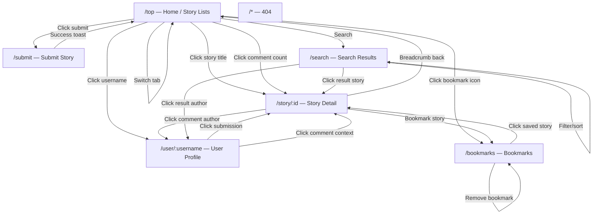
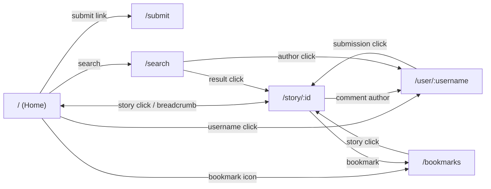

# Design Specification — HN Redesign

<!-- Produced by: Natasha (Designer) -->

## User Flows



## Page Specifications

### Page: Home / Story Lists (`/`, `/top`, `/new`, `/best`, `/ask`, `/show`)

#### Purpose

The primary landing experience. Users scan stories, switch between types, and decide what to read.

#### Layout — Desktop

```
┌──────────────────────────────────────────────────────────────┐
│  [Header — sticky]                                           │
│  🔶 HN    Top  New  Best  Ask  Show    [🔍]    🔖 3    ✏️    │
├──────────────────────────────────────────────────────────────┤
│                                                              │
│  ┌────────────────────────────────────────────────────────┐  │
│  │ 1. Story Title                                    🔖   │  │
│  │    (domain.com) · 142 pts · by user · 3h · 💬 87      │  │
│  ├────────────────────────────────────────────────────────┤  │
│  │ 2. Another Story Title                            🔖   │  │
│  │    (other.com) · 98 pts · by user2 · 5h · 💬 43       │  │
│  ├────────────────────────────────────────────────────────┤  │
│  │ 3. Ask HN: Question Here?            [Ask HN]    🔖   │  │
│  │    52 pts · by asker · 2h · 💬 31                      │  │
│  └────────────────────────────────────────────────────────┘  │
│                                                              │
│  Content max-width: 720px, centered                          │
└──────────────────────────────────────────────────────────────┘
```

#### Layout — Mobile

```
┌──────────────────────┐
│ 🔶 HN       [🔍] 🔖 ✏️│
│ Top New Best Ask Show │ ← horizontally scrollable
├──────────────────────┤
│                      │
│ Story Title          │
│ (domain) · 142 pts   │
│ by user · 3h · 💬 87 │
│ ──────────────────── │
│ Another Story        │
│ ...                  │
└──────────────────────┘
```

#### Components Used

| Component | Variant | Notes |
|-----------|---------|-------|
| Header | default | Sticky, with active tab |
| TabBar | nav-tabs | In header, switches story type |
| StoryCard | default / ask / show | Repeated for each story |
| BookmarkButton | icon-only | On each story card |
| Badge | ask / show | On respective story types |

#### Interactions

| Trigger | Action | Result |
|---------|--------|--------|
| Click tab | Switch story type | URL changes, list updates, no page reload |
| Click story title | Navigate to detail | Route to `/story/:id` |
| Click username | Navigate to profile | Route to `/user/:username` |
| Click comment count | Navigate to detail | Route to `/story/:id`, scroll to comments |
| Click bookmark icon | Toggle bookmark | Icon fills/unfills, bookmark context updated |

#### States

- **Loading:** Skeleton cards (3–5 shimmer placeholders)
- **Empty:** EmptyState — "No stories found" (unlikely with mock data)
- **Error:** N/A (mock data)

#### Responsive Behavior

| Breakpoint | Changes |
|------------|---------|
| Mobile | Single column, full-width cards, stacked metadata, horizontal scroll tabs |
| Tablet | Single column, comfortable margins |
| Desktop | Max-width 720px centered, side padding |

#### Acceptance Criteria

- [ ] All 5 story types accessible via tabs
- [ ] Active tab visually highlighted
- [ ] URL updates when switching tabs (enables browser back)
- [ ] Stories render with correct variant per type
- [ ] Bookmark state persists across tab switches

---

### Page: Story Detail (`/story/:id`)

#### Purpose

Deep-read page. Shows full story info and the threaded comment discussion.

#### Layout — Desktop

```
┌──────────────────────────────────────────────────────────────┐
│  [Header — sticky]                                           │
├──────────────────────────────────────────────────────────────┤
│  Breadcrumb: Top Stories › Story Title                        │
│                                                              │
│  ┌────────────────────────────────────────────────────────┐  │
│  │  Story Title Here                                 🔖   │  │
│  │  (domain.com) · 256 pts · by author · 6h ago           │  │
│  │                                                        │  │
│  │  [Story text if Ask/Show HN]                           │  │
│  └────────────────────────────────────────────────────────┘  │
│                                                              │
│  ── 87 comments ──────────────────────────────────────────   │
│                                                              │
│  │ user1 · 3h ago                                    [−]     │
│  │ Comment text here...                                      │
│  │                                                           │
│  │   │ user2 · 2h ago  [OP]                          [−]     │
│  │   │ Reply text...                                         │
│  │   │                                                       │
│  │   │   │ user3 · 1h ago                            [−]     │
│  │   │   │ Nested reply...                                   │
│                                                              │
│  Max-width: 720px, centered                                  │
└──────────────────────────────────────────────────────────────┘
```

#### Layout — Mobile

Same structure, reduced indentation (12px vs 20px per level), full-width.

#### Components Used

| Component | Variant | Notes |
|-----------|---------|-------|
| Header | default | |
| Breadcrumb | — | Links back to originating list |
| StoryCard | detail variant (larger title, full text) | Single instance at top |
| BookmarkButton | with-label | On story header |
| CommentTree | — | Recursive rendering |
| Comment | default / op | Per comment |
| UserLink | default / op | On each comment |
| Badge | op | On OP comments |

#### Interactions

| Trigger | Action | Result |
|---------|--------|--------|
| Click collapse toggle | Hide/show comment children | Comment body + children collapse, "[+] N children" shown |
| Click username | Navigate to profile | Route to `/user/:username` |
| Click breadcrumb | Navigate back | Route to list page |
| Click bookmark | Toggle bookmark | State update + visual change |

#### States

- **Loading:** Skeleton for story header + shimmer comment blocks
- **Not found:** If invalid ID, show "Story not found" with link home

#### Acceptance Criteria

- [ ] Story displays all metadata (title, domain, points, author, time)
- [ ] Ask HN / Show HN body text renders below title
- [ ] Comments nested at least 4 levels with distinct left-border colors
- [ ] Collapse/expand works per comment
- [ ] OP badge shown on story author's comments
- [ ] Breadcrumb shows correct originating list type

---

### Page: User Profile (`/user/:username`)

#### Purpose

View a user's identity and their contributions. Creates cross-linking between stories and users.

#### Layout — Desktop

```
┌──────────────────────────────────────────────────────────────┐
│  [Header]                                                     │
├──────────────────────────────────────────────────────────────┤
│                                                              │
│  ┌────────────────────────────────────────────────────────┐  │
│  │  👤 username                                           │  │
│  │  🏆 12,345 karma  ·  📅 Member since Jan 2015         │  │
│  │                                                        │  │
│  │  About: Bio text goes here, can be multiple lines.     │  │
│  └────────────────────────────────────────────────────────┘  │
│                                                              │
│  [Submissions]  [Comments]     ← TabBar (content-tabs)       │
│  ──────────────────────────────────────────────────────────   │
│                                                              │
│  (When Submissions tab active:)                              │
│  ┌─ StoryCard ──────────────────────────────────────────┐    │
│  │  Their story title...                                │    │
│  └──────────────────────────────────────────────────────┘    │
│                                                              │
│  (When Comments tab active:)                                 │
│  ┌─ Comment snippet ────────────────────────────────────┐    │
│  │  "Comment text preview..." — on Story Title · 3h ago │    │
│  └──────────────────────────────────────────────────────┘    │
│                                                              │
│  Max-width: 720px, centered                                  │
└──────────────────────────────────────────────────────────────┘
```

#### Layout — Mobile

Same structure, full-width cards, stacked user info.

#### Components Used

| Component | Variant | Notes |
|-----------|---------|-------|
| Header | default | |
| TabBar | content-tabs | Submissions / Comments |
| StoryCard | default | For submissions list |
| Badge | score | For karma display |

#### Interactions

| Trigger | Action | Result |
|---------|--------|--------|
| Click tab | Switch between submissions/comments | Content swaps, no route change |
| Click submission | Navigate to story | Route to `/story/:id` |
| Click comment context | Navigate to story | Route to `/story/:id` |

#### States

- **Loading:** Skeleton for user info + list shimmer
- **Not found:** "User not found" with link home

#### Acceptance Criteria

- [ ] User info displays: username, karma, member since, about
- [ ] Tabs switch between submissions and comments
- [ ] Submissions show as StoryCards
- [ ] Comments show with text preview + link to parent story
- [ ] All links navigate correctly

---

### Page: Submit Story (`/submit`)

#### Purpose

Form for submitting a new story. Exercises form design, validation, and a different interaction model.

#### Layout — Desktop

```
┌──────────────────────────────────────────────────────────────┐
│  [Header]                                                     │
├──────────────────────────────────────────────────────────────┤
│                                                              │
│  Submit Story                                                │
│                                                              │
│  ┌──────────────────────┐  ┌──────────────────────────────┐ │
│  │ Type: [Link] [Ask]   │  │ Preview                      │ │
│  │                      │  │                              │ │
│  │ Title:               │  │ ┌──────────────────────────┐ │ │
│  │ [________________]   │  │ │ (Live StoryCard preview) │ │ │
│  │                      │  │ └──────────────────────────┘ │ │
│  │ URL:                 │  │                              │ │
│  │ [________________]   │  │                              │ │
│  │                      │  │                              │ │
│  │ [Submit Story]       │  │                              │ │
│  └──────────────────────┘  └──────────────────────────────┘ │
│                                                              │
│  Max-width: 720px, centered                                  │
└──────────────────────────────────────────────────────────────┘
```

#### Layout — Mobile

```
┌──────────────────────┐
│ [Header]              │
├──────────────────────┤
│ Submit Story          │
│                      │
│ Type: [Link] [Ask]   │
│                      │
│ Title:               │
│ [________________]   │
│ URL:                 │
│ [________________]   │
│                      │
│ Preview:             │
│ ┌──────────────────┐ │
│ │ StoryCard preview│ │
│ └──────────────────┘ │
│                      │
│ [Submit Story]       │
└──────────────────────┘
```

#### Components Used

| Component | Variant | Notes |
|-----------|---------|-------|
| Header | default | |
| StoryForm | link / ask | Toggleable |
| StoryCard | default | Preview mode |
| Toast | success | On successful submit |

#### Interactions

| Trigger | Action | Result |
|---------|--------|--------|
| Toggle type | Switch Link/Ask fields | URL field shown/hidden, text field shown/hidden |
| Type in fields | Update preview | Live StoryCard preview updates |
| Click Submit | Validate + submit | Success → toast + navigate home. Error → inline messages |
| Invalid field | Show error | Red border + error message below field |

#### States

- **Default:** Empty form, preview shows placeholder
- **Filling:** Preview updates live
- **Validation error:** Red borders, error text
- **Submitting:** Button shows spinner, disabled
- **Success:** Toast appears, redirect to home

#### Acceptance Criteria

- [ ] Type toggle switches between Link and Ask HN modes
- [ ] Title required, 1-300 chars
- [ ] URL validated when in Link mode
- [ ] Text field shown only in Ask mode
- [ ] Live preview renders a StoryCard as user types
- [ ] Submit button disabled until form is valid
- [ ] Success toast shown, then redirect to home
- [ ] Inline validation errors displayed per field

---

### Page: Search (`/search?q=`)

#### Purpose

Search across stories and comments. URL-driven state with filtering.

#### Layout — Desktop

```
┌──────────────────────────────────────────────────────────────┐
│  [Header — search bar pre-filled with query]                  │
├──────────────────────────────────────────────────────────────┤
│                                                              │
│  Results for "query"                                         │
│                                                              │
│  [FilterBar: Type ▾  Sort ▾  Date ▾]                         │
│                                                              │
│  ┌─ StoryCard ──────────────────────────────────────────┐    │
│  │  Matching Story Title (with query highlighted)       │    │
│  └──────────────────────────────────────────────────────┘    │
│  ┌─ Comment result ─────────────────────────────────────┐    │
│  │  "...matching comment text..." — on Story Title      │    │
│  └──────────────────────────────────────────────────────┘    │
│                                                              │
│  Max-width: 720px, centered                                  │
└──────────────────────────────────────────────────────────────┘
```

#### Layout — Mobile

Same, full-width. FilterBar scrolls horizontally.

#### Components Used

| Component | Variant | Notes |
|-----------|---------|-------|
| Header | default | Search bar pre-filled |
| FilterBar | — | Type, sort, date filters |
| StoryCard | default | For story results |
| EmptyState | search | When no results match |

#### Interactions

| Trigger | Action | Result |
|---------|--------|--------|
| Submit search | Update URL query params | Results re-filter |
| Change filter | Update URL query params | Results re-filter |
| Click story result | Navigate to story | Route to `/story/:id` |
| Click comment result | Navigate to story | Route to `/story/:id` |

#### States

- **Loading:** Skeleton results
- **Empty:** EmptyState — "No results for 'query'. Try different keywords."
- **Results:** List of matching stories/comments

#### Acceptance Criteria

- [ ] Query persisted in URL (`?q=...`)
- [ ] Header search bar pre-filled with current query
- [ ] Filter by type (all/stories/comments) works
- [ ] Sort by date or points works
- [ ] Empty state shown for no results
- [ ] Results link to correct stories/profiles

---

### Page: Bookmarks (`/bookmarks`)

#### Purpose

View and manage saved/bookmarked stories. Client-side persistence via localStorage.

#### Layout — Desktop

```
┌──────────────────────────────────────────────────────────────┐
│  [Header]                                                     │
├──────────────────────────────────────────────────────────────┤
│                                                              │
│  Your Bookmarks (3)                                          │
│                                                              │
│  ┌─ StoryCard ──────────────────────────────────────────┐    │
│  │  Bookmarked Story Title                         [✕]  │    │
│  │  (domain.com) · 142 pts · by user · 3h · 💬 87       │    │
│  └──────────────────────────────────────────────────────┘    │
│  ┌─ StoryCard ──────────────────────────────────────────┐    │
│  │  Another Saved Story                            [✕]  │    │
│  └──────────────────────────────────────────────────────┘    │
│                                                              │
│  Max-width: 720px, centered                                  │
└──────────────────────────────────────────────────────────────┘
```

#### Layout — Mobile

Same, full-width cards.

#### Components Used

| Component | Variant | Notes |
|-----------|---------|-------|
| Header | default | Bookmark icon active |
| StoryCard | default | With remove button instead of bookmark toggle |
| BookmarkButton | icon-only | Shows as remove (filled → click to remove) |
| EmptyState | bookmarks | When no bookmarks saved |

#### Interactions

| Trigger | Action | Result |
|---------|--------|--------|
| Click story | Navigate to detail | Route to `/story/:id` |
| Click remove | Remove bookmark | Story removed from list, context + localStorage updated |

#### States

- **Empty:** EmptyState — "No bookmarks yet. Save stories to find them here later." with bookmark icon
- **With bookmarks:** List of StoryCards

#### Acceptance Criteria

- [ ] Shows all bookmarked stories
- [ ] Count displayed in page heading
- [ ] Remove button removes bookmark and updates list immediately
- [ ] Empty state shown when no bookmarks
- [ ] Bookmarks persist across page reloads (localStorage)
- [ ] Header bookmark icon count stays in sync

---

### Page: 404 Not Found (`/*`)

#### Purpose

Catch-all for invalid routes. Friendly, styled, with navigation back.

#### Layout

```
┌──────────────────────────────────────────────────────────────┐
│  [Header]                                                     │
├──────────────────────────────────────────────────────────────┤
│                                                              │
│                     🔍                                       │
│              Page not found                                  │
│     The page you're looking for doesn't exist.               │
│              [Go to Home →]                                  │
│                                                              │
└──────────────────────────────────────────────────────────────┘
```

#### Acceptance Criteria

- [ ] Displayed for any unmatched route
- [ ] Styled consistently with app design
- [ ] Link/button navigates to home (`/`)

---

## Navigation Structure



## Global Interactions

| Interaction | Behavior |
|-------------|----------|
| Page transitions | Subtle fade transition (200ms) between routes via CSS |
| Scroll position | Reset to top on route change |
| Browser back/forward | Works correctly with all routes, React Router handles history |
| Active link highlighting | Current route/tab highlighted in Header |
| Toast notifications | Slide in from top-center, auto-dismiss 3s, max 3 stacked |
| Touch targets | Minimum 44×44px on all interactive elements (mobile) |
| Focus states | Visible focus ring (2px primary color outline, 2px offset) for keyboard nav |
| Link hover | Underline + slight color darken on all text links |

---

**Status:** Complete
**Date:** 2026-03-08
